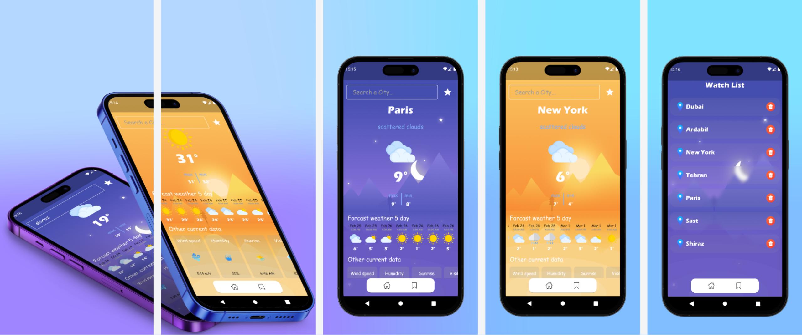

# Weather app

This project is written in the Flutter framework and makes use of the `api.openweathermap.org` API to provide accurate current weather information.

The app also provides a weather forecast for up to five days in the future. This helps users plan their activities accordingly and be prepared for any changes in the weather.

## Road map:
- `State Management Bloc`
- `Dependency injection`
- `Clean Architecture`
- `Repository Pattern`
- `Floor Database`
- `Dio call API`
- `Testing`
- `Get It`

